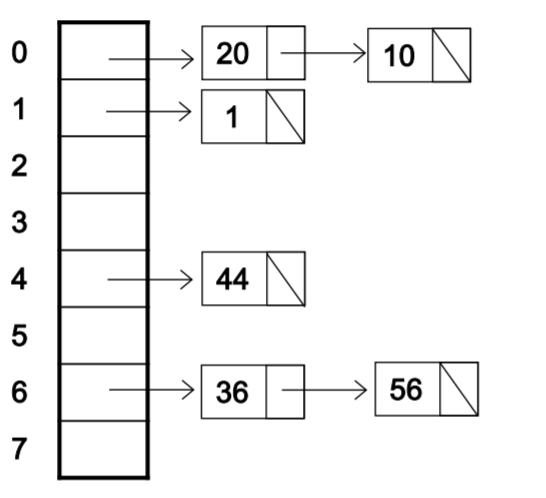

# Hashing

* key를 hash function을 통해 흩뿌려주는 것이 hash. (hash는 '흩뿌리다' 라는 뜻)

* O(1)만에 find, insert, delete할 수 있음

* hash function

  * key를 넣어 key값이 들어갈 배열의 index를 리턴받는다.
  * 이때 collision발생 가능 - 서로 다른 key가 똑같은 index로 갈 수도 있음

* Open hashing

  * hashing된 결과값을 list의 header로 쓴다. collision에 대비해서 linkedlist를 달아놓음.
  * 충돌이 자주 발생한다면 최악의 경우 search에는 O(N), 일반적으로 충돌이 최소화된다면 O(1). hash function을 통해 인덱스에 바로 접근해서 찾기 때문. 

  

